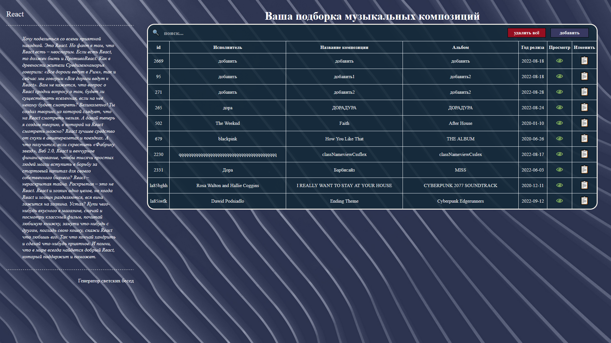

<h1 align="center">Create sample music</h1>

## Table of Contents

-  [Overview](#overview)
-  [Built With](#built-with)
-  [How to use](#how-to-use)
-  [Contact](#contact)
-  [Acknowledgements](#acknowledgements)

## Overview

Create sample music home page

### Built With

The project is built on a JS-library for creating a user interface React using libraries:
-  react-redux
-  react-router
-  redux-saga
-  react-transition-group
-  normalizr
-  uniqid
-  sass

## How To Use

For correct use, you need to install the following dependencies:
1. npm install (install node.js)
2. npm install redux
3. npm install @reduxjs/toolkit
4. npm install react-router
5. npm install redux-saga
6. npm install react-transition-group --save (for create components with animation transition)
8. npm install uniqid (for create unique id)
9. npm install -g sass
10. npm install -g json-server (for the local server "full fake REST API")

## Acknowledgements

-  [Node.js](https://nodejs.org/)
-  [React](https://reactjs.org/)
-  [react-redux](https://react-redux.js.org/)
-  [react-router](https://reactrouter.com/en/main)
-  [redux-saga](https://redux-saga.js.org/)
-  [react-transition-group](https://reactcommunity.org/react-transition-group/)
-  [normalizr](https://necolas.github.io/normalize.css/8.0.1/normalize.css)
-  [uniqid](https://www.npmjs.com/package/uniqid)
-  [sass](https://sass-scss.ru/install/)
-  [json-server](https://github.com/typicode/json-server)

## Contact

-  GitHub [MichaelRud99](https://github.com/MichaelRud99)
-  VK [Michael Rudenok](https://vk.com/id98146849)